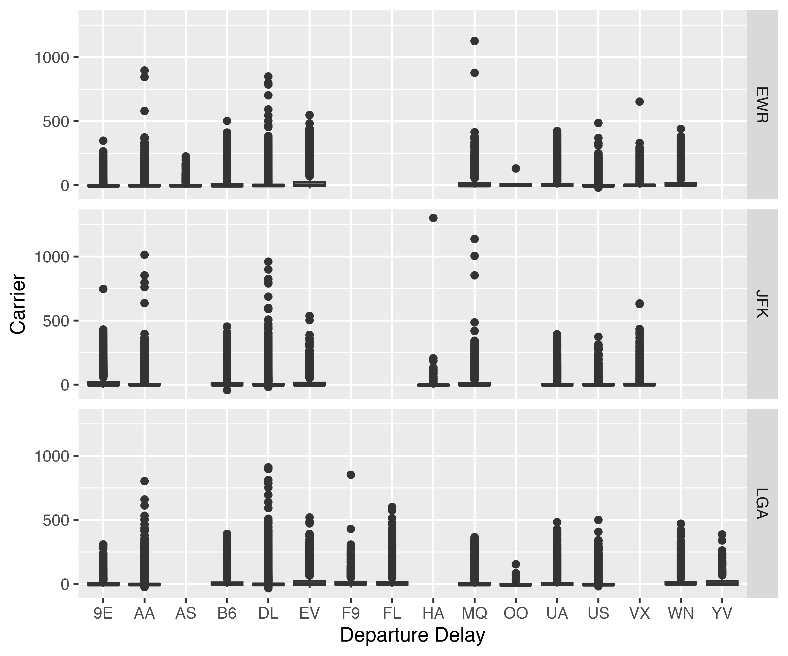

```{r}
#| include: FALSE
#--- packages ---#
library(flextable)
library(officer)
library(modelsummary)
library(tidyverse)

#--- chunk options ---#
knitr::opts_chunk$set(
  echo = FALSE,
  error = TRUE,
  messages = FALSE,
  warnings = FALSE
)
```


# Introduction

Nothing is more frustrating than flight delays. The goal of this article is to understand what weather variables affect flights delays so that we can control weather when such time comes in the future[^1].

[^1]: This is just for illustrating how to create a footnote

# Method

Regression analysis was used in this article. The econometric model writes as follows (equation \ref{econometric-model}):

This works for both html and pdf output formats, but not word:

```{=tex}
\begin{align}
y_{i,t} = \beta_0 + \beta_1 temp_{i,t} + \beta_2 precip_{i,t} + \beta_3 wind_speed_{i,t} + v_{i,t} \label{econometric-model}
\end{align}
```

I can cross-reference the above equation like this only for pdf: Equation \ref{econometric-model}.

This works for all formats:

$$
y_{i,t} = \beta_0 + \beta_1 temp_{i,t} + \beta_2 precip_{i,t} + \beta_3 wind_speed_{i,t} + v_{i,t}
$$ {#eq-econometric-model}

You can cross-reference like this for all formats like this: @eq-econometric-model

The following works for html and word, but not pdf (you will encounter an error and cannot compile a pdf file).

$$
\begin{align}
y_{i,t} & = \beta_0 + \beta_1 temp_{i,t} + \beta_2 precip_{i,t} + \beta_3 wind_speed_{i,t} + v_{i,t} \\
v_{i,t} & = \rho Wv + \mu
\end{align}
$$ {#eq-econometric-model-2}

@eq-econometric-model-2

## Code availability

All computations (including creating tables and plots) were conducted using R software [@R], The @fixest package was used to run regressions.

# Data

We use publicly available datasets from the R `nycflights13` package [@nycflights13]. @tbl-sum-stat presents the summary statistics.

```{r}
#| label: tbl-sum-stat
#| tbl-cap: Summary Statistics
library(modelsummary)
reg_data <- readRDS("reg_data.rds")
modelsummary::datasummary(dep_delay + temp + precip + wind_speed ~ Mean + SD + Max, data = reg_data)
```

```{r}
#| include: false
library(flextable)

sum_table <- 
  modelsummary::datasummary(dep_delay + temp + precip + wind_speed ~ Mean + SD + Max, data = reg_data, output = "flextable") %>%
  fontsize(size = 9, part = "all")

save_as_image(sum_table, "templates/summary_table.png", res = 300)
```

Include a table as a figure (@tbl-sum-stat-from-an-image):

```{r}
#| label: tbl-sum-stat-from-an-image
#| tbl-cap: Summary Statistics 
 

```

As you can see, this works just fine. 

Figure @fig-hist-delay-png shows the histogram of departure delay by carrier for each of the airports. 

```{r}
#| label: fig-hist-delay-png
#| fig-cap: Distribution of delay by carrier


```

Importing a pdf file does not work for html output. Is @fig-hist-delay_pdf working?

```{r}
#| label: fig-hist-delay_pdf
#| fig-cap: Distribution of delay by carrier

knitr::include_graphics("results/figures/delay_box.pdf")
```

# Results and Discussions

@tbl-reg-results presents the regression results.

```{r}
#| label: tbl-reg-results
#| tbl-cap: Regression Results
reg_table <-
  readRDS(here::here("results/reg_results.rds")) %>%
  modelsummary(
    stars = TRUE,
    outpuy = "flextable",
    gof_omit = "IC|Log|Adj|F|Pseudo|Within|RMSE"
  )
reg_table
```

# Conclusion

Weather matters.

# References {-}

::: {#refs}
:::
